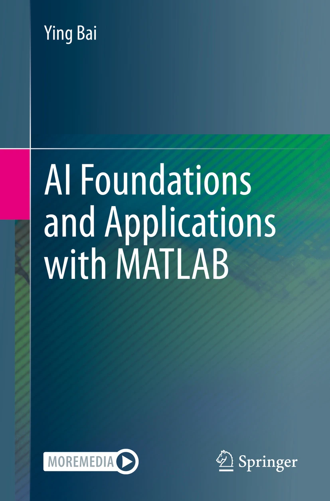

# AI Foundations and Applications with MATLAB
This repository accompanies the book [*AI Foundations and Applications with MATLAB*](https://link.springer.com/book/10.1007/978-3-031-84423-2) by Ying Bai (Springer, 2025).

The datasets used in the exercises the can be found [here](https://sn.pub/vm3e56).

